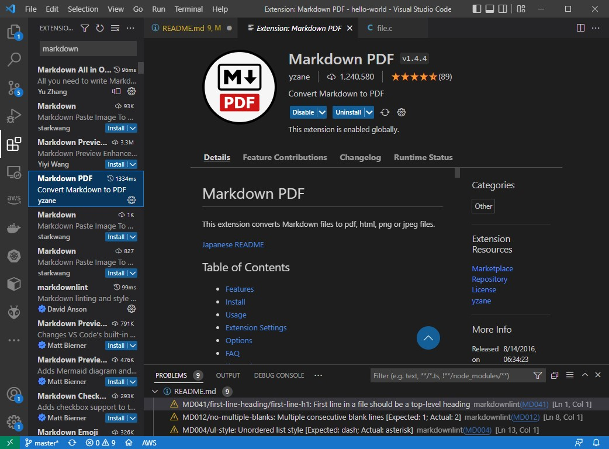

- [hello-world](#hello-world)
  - [1. Experiment 1](#1-experiment-1)
  - [2. Experiment 2](#2-experiment-2)
    - [`file.c`](#filec)
    - [Commands](#commands)
  - [3. Disassembly](#3-disassembly)
  - [Handling *markdown* article](#handling-markdown-article)


# hello-world

get assembler output from c source in gcc

* [stackoverflow](https://stackoverflow.com/questions/137038/how-do-you-get-assembler-output-from-c-c-source-in-gcc)
* [hello asm](https://stackoverflow.com/questions/7190050/how-do-i-compile-the-asm-generated-by-gcc)
* [gcc and objdump](https://tuttlem.github.io/2015/01/12/a-simple-example-with-gcc-and-objdump.html)


## 1. Experiment 1

```sh
# create assembler code:
$ g++ -S -fverbose-asm -g -O2 hello.cc -o hello.s
# create asm interlaced with source lines:
$ as -alhnd hello.s > hello.lst

$ gcc hello.s -o hello
$ ./hello
Hello, World!
```

## 2. Experiment 2

### `file.c`

```c
#include <stdio.h>

int main(int argc, char** argv){
  printf("Hello World\n");
  return 0;
}
```

### Commands

```sh
$ gcc file.c -S -o file.S
$ gcc file.S -o hello2
$ ./hello2
Hello World

```

## 3. Disassembly

```sh
$ objdump --disassemble-all --section=.rdata -M intel hello2.exe > hello-disasm_01.s

$ objdump -d -M intel -S hello2.exe > hello-disasm_02.s
```

## Handling *markdown* article

VSCode extensions:

* 
* 

> Press `Ctl-Shift-P` to show the **Command Palette**.

