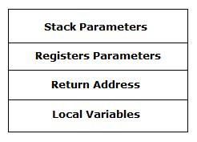

- [hello-world](#hello-world)
  - [1. Experiment 1](#1-experiment-1)
  - [2. Experiment 2](#2-experiment-2)
    - [`file.c`](#filec)
    - [Commands](#commands)
  - [3. Disassembly](#3-disassembly)
  - [4. Investigate the *function call*](#4-investigate-the-function-call)
  - [5. Microsoft assembler `ml64.exe`](#5-microsoft-assembler-ml64exe)
    - [Console App](#console-app)
    - [Windows App](#windows-app)
      - [A *MessageBox*](#a-messagebox)
      - [A *Window*](#a-window)
  - [Handling *markdown* article](#handling-markdown-article)
  - [x64 Assembly](#x64-assembly)
  - [`gas`'s implementation](#gass-implementation)

# hello-world

Learn assembly language by getting assembler output of c source codes. Then crafting the assembly programming by hand.

* [stackoverflow](https://stackoverflow.com/questions/137038/how-do-you-get-assembler-output-from-c-c-source-in-gcc)
* [hello asm](https://stackoverflow.com/questions/7190050/how-do-i-compile-the-asm-generated-by-gcc)
* [gcc and objdump](https://tuttlem.github.io/2015/01/12/a-simple-example-with-gcc-and-objdump.html)

## 1. Experiment 1

```sh
# create assembler code:
$ g++ -S -fverbose-asm -g -O2 hello.cc -o hello.s
# create asm interlaced with source lines:
$ as -alhnd hello.s > hello.lst

$ gcc hello.s -o hello
$ ./hello
Hello, World!
```

## 2. Experiment 2

### `file.c`

```c
#include <stdio.h>

int main(int argc, char** argv){
  printf("Hello World\n");
  return 0;
}
```

### Commands

```sh
$ gcc file.c -S -o file.S
$ gcc file.S -o hello2
$ ./hello2
Hello World

$ gcc file.c -S -fno-asynchronous-unwind-tables -o file.asm
# This assembly code doesn't compile on Windows
```

## 3. Disassembly

```sh
$ objdump --disassemble-all --section=.rdata -M intel hello2.exe > hello-disasm_01.s

$ objdump -d -M intel -S hello2.exe > hello-disasm_02.s
```

## 4. Investigate the *function call*

```sh
$ gcc -S -o func-call.s func-call.c 
$ gcc func-call.s -o func-call
$ objdump -d -M intel -S func-call.exe > func-call_disasm.s

$ gcc -S -o simple.s simple.c 
$ gcc -o simple simple.s
$ ./simple.exe 

$ gcc -o simple simple2.s
```

## 5. Microsoft assembler `ml64.exe`

### Console App

- [HelloWorld](http://www.masmforum.com/board/index.php?topic=10880.0)
- [masm32](http://www.masm32.com/)
- [The MASM in 64 Bit Youtube channel](https://www.youtube.com/channel/UC9KbZKa9_5WFlMqd3Tw71Ow/videos)

x64 Native Tools Command Prompt for VS 2017:

```sh
E:\workspace_asm\hello-world>ml64.exe HelloWorld.asm /link /subsystem:console /defaultlib:kernel32.lib /entry:main
Microsoft (R) Macro Assembler (x64) Version 14.16.27045.0
Copyright (C) Microsoft Corporation.  All rights reserved.

 Assembling: HelloWorld.asm
Microsoft (R) Incremental Linker Version 14.16.27045.0
Copyright (C) Microsoft Corporation.  All rights reserved.

/OUT:HelloWorld.exe
HelloWorld.obj
/subsystem:console
/defaultlib:kernel32.lib
/entry:main

E:\workspace_asm\hello-world>HelloWorld.exe
Hello x64 World!

$ objdump -d -M intel -S HelloWorld.exe > HelloWorld.lst
```


### Windows App

- [x64 Assembly](https://www.codeproject.com/Articles/17263/Moving-to-Windows-Vista-x64#x64_Assembly)

#### A *MessageBox*

x64 Native Tools Command Prompt for VS 2017:

```sh
E:\workspace_asm\hello-world>ml64.exe HelloWorld2.asm /link /subsystem:windows /defaultlib:kernel32.lib /defaultlib:user32.lib /entry:Main
Microsoft (R) Macro Assembler (x64) Version 14.16.27045.0
Copyright (C) Microsoft Corporation.  All rights reserved.

 Assembling: HelloWorld2.asm
Microsoft (R) Incremental Linker Version 14.16.27045.0
Copyright (C) Microsoft Corporation.  All rights reserved.

/OUT:HelloWorld2.exe
HelloWorld2.obj
/subsystem:windows
/defaultlib:kernel32.lib
/defaultlib:user32.lib
/entry:Main

E:\workspace_asm\hello-world>HelloWorld2.exe
```

Output:


#### A *Window*

x64 Native Tools Command Prompt for VS 2017:

```sh
E:\workspace_asm\hello-world>ml64.exe Test.asm /link /subsystem:windows /defaultlib:kernel32.lib /defaultlib:user32.lib /entry:Main samples\test\test.res
Microsoft (R) Macro Assembler (x64) Version 14.16.27045.0
Copyright (C) Microsoft Corporation.  All rights reserved.

 Assembling: Test.asm
Microsoft (R) Incremental Linker Version 14.16.27045.0
Copyright (C) Microsoft Corporation.  All rights reserved.

/OUT:Test.exe
Test.obj
/subsystem:windows
/defaultlib:kernel32.lib
/defaultlib:user32.lib
/entry:Main
samples\test\test.res

E:\workspace_asm\hello-world>Test.exe
```

Output:


## Handling *markdown* article

VSCode extensions:

* 
* 

> Press `Ctl-Shift-P` to show the **Command Palette**.


## x64 Assembly

- [AMD64 documentation](http://www.amd.com/us-en/Processors/DevelopWithAMD/0,,30_2252_739_7044,00.html)

Registers in the x64 syntax:

- 8 new general-purpose registers (GPRs).
- 8 new 128-bit XMM registers.

Of course, all general-purpose registers are 64 bits wide. The old ones we already knew are easy to recognize in their 64-bit form: rax, rbx, rcx, rdx, rsi, rdi, rbp, rsp (and rip if we want to count the instruction pointer). These old registers can still be accessed in their smaller bit ranges, for instance: rax, eax, ax, ah, al. The new registers go from r8 to r15, and can be accessed in their various bit ranges like this: r8 (qword), r8d (dword), r8w (word), r8b (low byte).


Applications can still use segments registers as base for addressing, but the 64-bit mode only recognizes three of the old ones (and only two can be used for base address calculations). Here's another figure:


And now, the most important things. Calling convention and stack. x64 assembly uses FASTCALLs as calling convention, meaning it uses registers to pass the first 4 parameters (and then the stack). Thus, the stack frame is made of: the stack parameters, the registers parameters, the return address (which I remind you is a qword) and the local variables. The first parameter is the rcx register, the second one rdx, the third r8 and the fourth r9. Saying that the parameters registers are part of the stack frame, makes it also clear that any function that calls another child function has to initialize the stack providing space for these four registers, even if the parameters passed to the child function are less than four. The initialization of the stack pointer is done only in the prologue of a function, it has to be large enough to hold all the arguments passed to child functions and it's always a duty of the caller to clean the stack. Now, the most important thing to understand how the space is provided in the stack frame is that the stack has to be 16-byte aligned. In fact, the return address has to be aligned to 16 bytes. So, the stack space will always be something like 16n + 8, where n depends on the number of parameters. Here's a small figure of a stack frame:



## `gas`'s implementation

"SEH" is Structured Exception Handling, a Windows feature.

I would like to show the patch for .pdata and .xdata generation of pe-coff targets via gas, and to get some feed-back. This patch includes support for arm, ppc, arm, sh (3&4), mips, and x64. As for x86 there is no OS support for runtime function information, I spared this part. It would just increase executable size for x86 PE and there is no real gain for this target.

Short overview:
There are at the moment three different function entry formats preset.

The first is the MIPS one. The second version is for ARM, PPC, SH3, and SH4 mainly for Windows CE. The third is the IA64 and x64 version. Note, the IA64 isn't implemented yet, but to find information about it, please see specification about [IA64](http://download.intel.com/design/Itanium/Downloads/245358.pdf).

The first version has just entries in the pdata section: BeginAddress, EndAddress, ExceptionHandler, HandlerData, and PrologueEndAddress. Each value is a pointer to the corresponding data and has size of 4 bytes.

The second variant has the following entries in the pdata section. BeginAddress, PrologueLength (8 bits), EndAddress (22 bits), Use-32-bit-instruction (1 bit), and Exception-Handler-Exists (1 bit). If the FunctionLength is zero, or the Exception-Handler-Exists bit is true, a DATA_EH block is placed directly before function entry.

The third version has a function entry block of BeginAddress (RVA), EndAddress (RVA), and UnwindData (RVA). The description of the prologue, excepetion-handler, and additional SEH data is stored within the UNWIND_DATA field in the xdata section.

- *.seh_proc <fct_name>*
  This specifies, that a SEH block begins for the function <fct_name>. This is valid for all targets.

- *.seh_endprologue*
  By this pseudo the location of the prologue end-address (taken by the current code address of the appearance of this pseudo). Valid for all targets.

- *.seh_handler <handler>[,<handler-data>]*
  This pseudo specifies the handler function to be used. For version 2 the handler-data field specifies the user optional data block. For version 3 the handler-data field can be a rva to user-data (for FHANDLER), if the name is @unwind the UHANDLER unwind block is generated, and if it is @except (or not specified at all) EHANDLER exception block is generated.

- *.seh_eh*
  This pseudo is used for version 2 to indicate the location of the function begin in assembly. Here the PDATA_EH data is may stored to.

- *.seh_32/.seh_no32*
  This pseudos are just used for version 2 (see above for description). At the moment it defaults to no32, if not specified.

- *.seh_endproc*
  By this pseudo the end of the SEH block is specified.

* *.seh_setframe <reg>,<offset>*
  By this pseudo the frame-register and the offset (value between 0-240 with 16-byte alignment) can be specified. This is just used by version 3.

* *.seh_stackalloc <size>*
  By this stack allocation in code is described for version 3.

- *.seh_pushreg <reg>*
  By this a general register push in code is described for version 3.

- *.seh_savereg <reg>*
  By this a general register save to memory in code is described for version 3.

- *.seh_savemm <mm>*
  By this a mm register save to memory in code is described for version 3.

- *.seh_savexmm*
By this a xmm register save to memory in code is described for version 3.

- *.seh_pushframe*
By this information about entry kind can be described for version 3.

- *.seh_scope <begin>,<end>,<handler>,<jump>*
  By this SCOPED entries for unwind or exceptions can be specified for version 3. This is just valid for UHANDLE and EHANDLER xdata descriptor and a global handler has to be specified. For handler and jump arguments, names of @1,@0, and @null can be used and they are specifying that a constant instead of a rva has to be used.